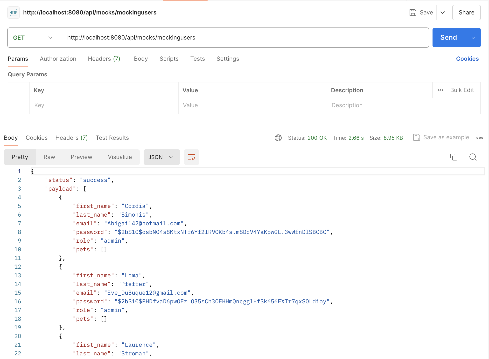
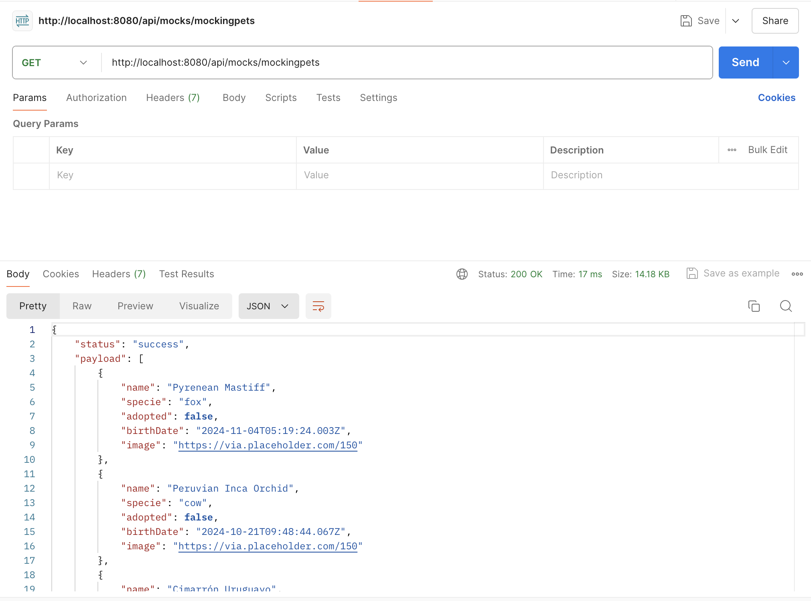
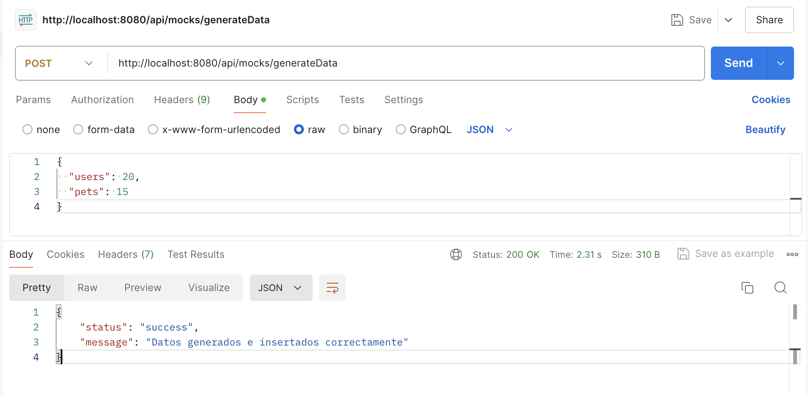
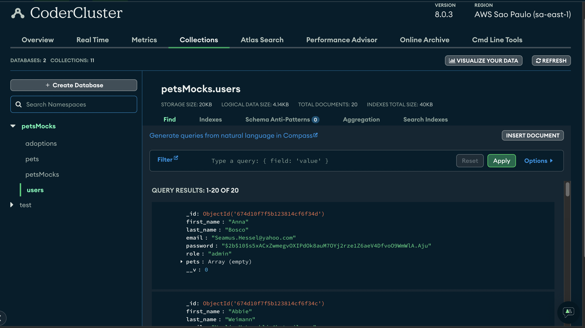
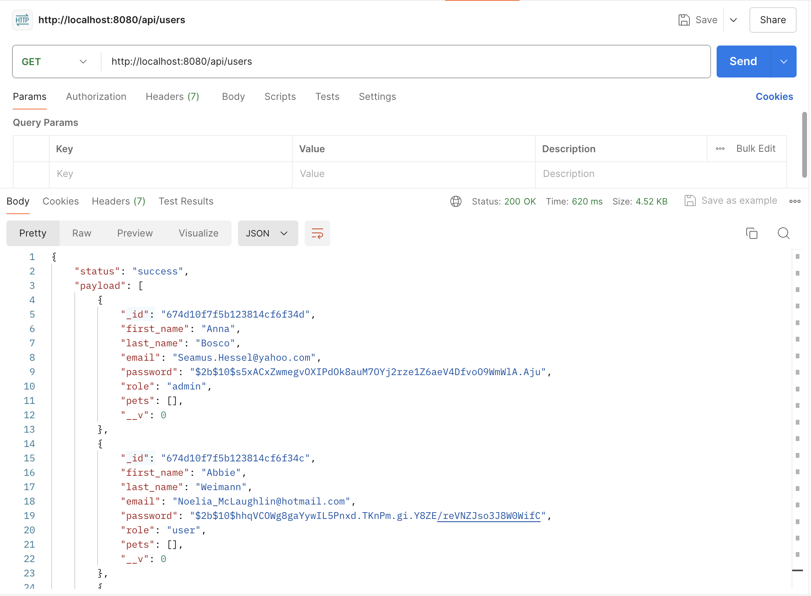
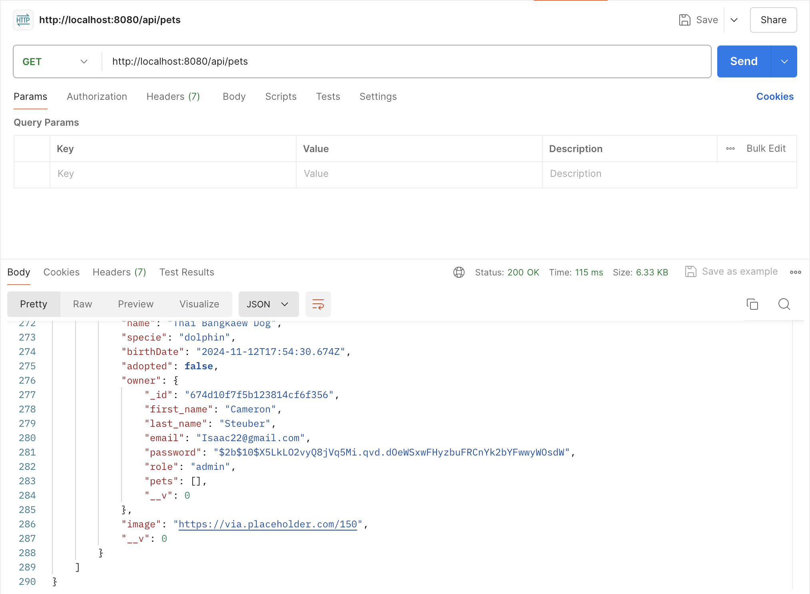

# Primera Entrega Backend 3 - Tomas Gordyn

## Instalación

1. **Clonar el repositorio:**
   git clone https://github.com/tgordyn/backend3.git
2. **Posicionarse en el directorio root del repositorio**
3. **Instalar las dependencias:**
   npm install
4. **Levantar proyecto:**
   npm run dev

## Endpoints agregados:

- /api/mocks/mockingusers: Devuelve 50 usuarios
  - 
- - /api/mocks/mockingpets: Devuelve 100 mascotas
  - 
- /api/mocks/generateData: Genera el número de usuarios y de mascotas que le pasemos por parámetro en el body. Ademas los guarda en MongoDB
  - 
  - 
- /api/users: Devuelve todos los usuarios de MongoDB
  - 
- /api/pets: Devuelve todos las mascotas de MongoDB
  - 
